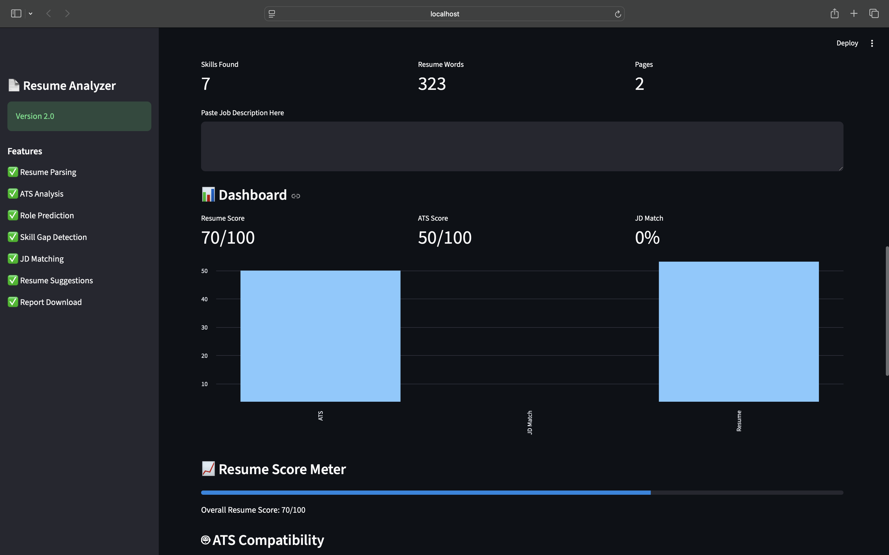

# 📄 Smart Resume Analyzer

<div align="center">

# 🚀 AI-Powered Smart Resume Analyzer

Analyze resumes with ATS Score, Resume Score, Role Prediction, Skill Detection, Resume Statistics, and PDF Report Generation.

Built using **Python** & **Streamlit**


</div>

---

# 📖 Overview

Smart Resume Analyzer is an AI-powered web application that helps students and job seekers improve their resumes before applying for jobs.

The application parses PDF resumes, calculates ATS compatibility, predicts suitable job roles, detects technical skills, analyzes resume quality, and generates a professional PDF report.

---

# ✨ Features

- 📄 Upload Resume (PDF)
- 🤖 ATS Compatibility Analysis
- 📊 Resume Score
- 💼 Role Prediction
- 🛠 Technical Skill Detection
- 📈 Resume Statistics
- 📄 Download PDF Report
- ⚡ Fast Streamlit Interface

---

# 🛠 Tech Stack

| Technology | Purpose |
|------------|----------|
| Python | Backend |
| Streamlit | Web Application |
| PyPDF2 | Resume Parsing |
| Regex | Information Extraction |
| Pandas | Data Processing |
| Matplotlib | Charts |
| FPDF | PDF Report |
| Git | Version Control |

---

# 🏗 System Architecture

```text
                    Resume PDF

                         │

                         ▼

              Resume Parser (PyPDF2)

                         │

                         ▼

             Information Extraction

                         │

        ┌────────────┬────────────┐

        ▼            ▼            ▼

   ATS Checker   Resume Score   Skills Detection

        │            │            │

        └────────────┼────────────┘

                     ▼

              Role Prediction

                     ▼

            Resume Statistics

                     ▼

          Suggestions Generator

                     ▼

         PDF Report Generation
```

---

# 📸 Application Screenshots

## 🏠 Home Page


---

## 📊 Resume Analysis Dashboard



---

## 📄 Generated PDF Report


---

# 📁 Project Structure

```text
smart_resume_parser/

├── app.py
├── parser.py
├── skills.py
├── requirements.txt
├── README.md
│
├── modules/
│   ├── ats_checker.py
│   ├── resume_scorer.py
│   ├── role_predictor.py
│   ├── skill_gap.py
│   └── jd_matcher.py
│
├── sample_resumes/
│
└── screenshots/
    ├── home.png
    ├── dashboard.png
    └── report.png
```

---

# ⚙ Installation

Clone the repository

```bash
git clone https://github.com/abdulsonu/smart-resume-analyzer.git
```

Move to project folder

```bash
cd smart_resume_parser
```

Create virtual environment

```bash
python -m venv venv
```

Activate environment

### macOS / Linux

```bash
source venv/bin/activate
```

### Windows

```bash
venv\Scripts\activate
```

Install dependencies

```bash
pip install -r requirements.txt
```

Run the application

```bash
python -m streamlit run app.py
```

---

# 🚀 Future Improvements

- AI Resume Summarizer
- Resume Keyword Optimization
- Cover Letter Generator
- Resume Ranking
- User Authentication
- Cloud Deployment
- Docker Support
- Multi-language Resume Analysis

---

# 👨‍💻 Developed By

## **Aravind Goud**

**Computer Science (AI & ML) Graduate**

### 🐙 GitHub

https://github.com/abdulsonu

---

# 🤲 Acknowledgement

> **ok, this project will continue to evolve with more AI-powered features and help students and job seekers build stronger resumes and achieve their career goals.**

---

# ⭐ Support

If you found this project useful,

⭐ Star this repository

🍴 Fork this repository

💙 Share it with others

🤝 Contributions are welcome!
